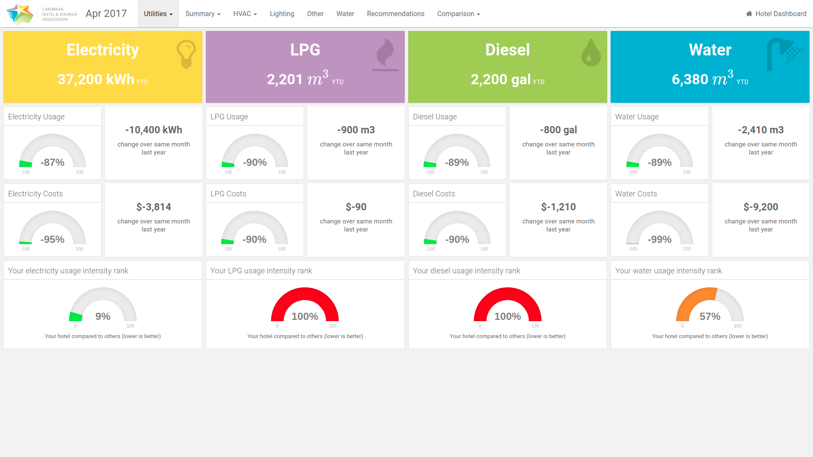
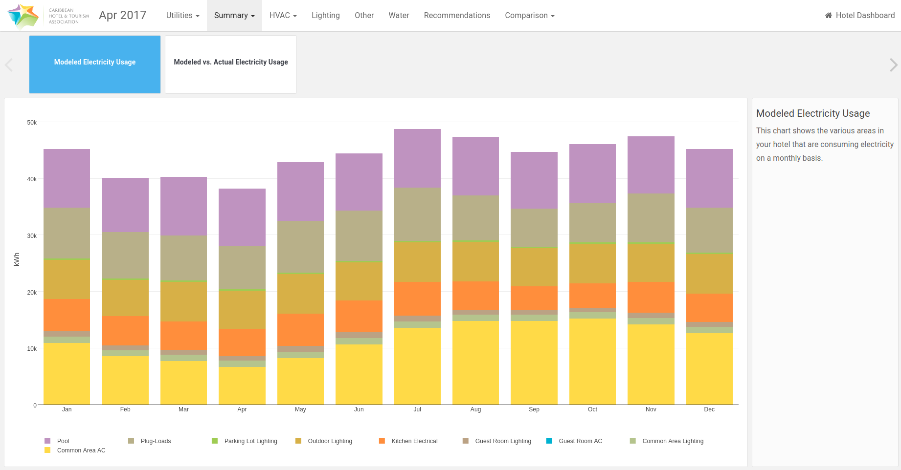
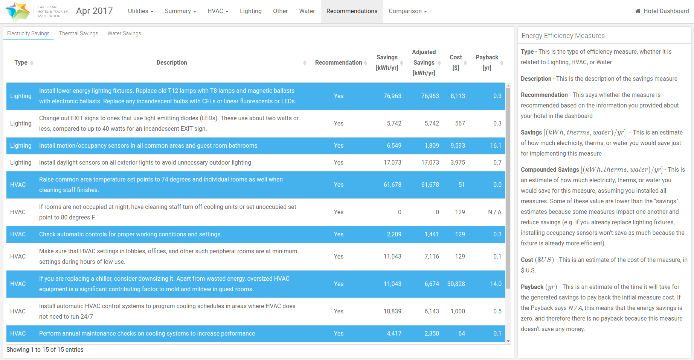

The Energy Benchmarking Tool (EBT) is a USAID funded project I worked on for [Deloitte](//deloitte.com). Most of the work was done between November 2016 and June 2017. The tool helps hoteliers optimize the energy usage in their hotels.

This article describes all the features and give some insights into the tools we’ve used. Click [here](//ebt.reto-wyss.com) to interact with a demo version.

# The Dashboard

The dashboard is the core of the EBT.  Hoteliers enter information about their hotel through a form. This data is then saved in a database. Hoteliers can then request analytics. An R script processes the data and renders an interactive dashboard.

## Lading Page

The dashboard's landing page presents a summary of the hotel to the hotelier. The hotelier can gauge the amount of electricity, LPG, diesel and water usage. The dashboard also reports how the hotel is doing compared to other hotel.

## Summary

The summary tab let's hoteliers explore how their energy usage changes based on the season. We report the usage grouped by months. To quantive progress hoteliers need to track their usage over several years. This serves a visual feedback of the effectivness of the implemented measures taken to reduce energy usage.

## Recommendations

The EBT provides in-depth recommendations to the hotelier. These recommendations are custom tailored to the hotel and ranked in terms of effectivness (energy saved) and efficiency (payback time).  

