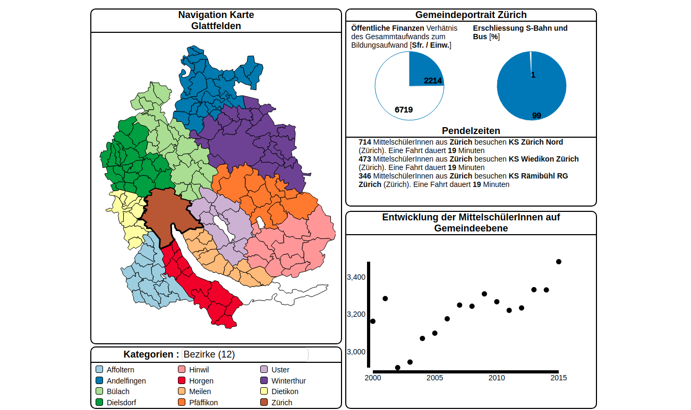

This project was part of a class in information system I took at University of Bern. The goal was the creation of a JavaScript application that visualizes Open Data. To play around with the live version, click [here](//mittelschulen-kanton-zuerich.opendata.iwi.unibe.ch/).

# It all starts with a Question

I wanted to create an app that addresses the change in high-school attendance in Kanton Zurich. I broke down the Question into:

* where do students attend high-school?
* where do they come from? 
* how long does it take to commute?
* how many students attend high-school?
* how did the number of students change over time?

# Combining Data Sources

I had two primary data-scources. The office of educational statistics of Zurich and the open data portal of Zurich. The office of educational statistics provided data on the number of students. This data showed how many students attended high-school. It was broken down by year and district. I then gathered extra data from the open data portal.

# Visualizing the Answers

The category button groups the districts based on some heuristic. Depending on the chosen heuristic the statistics change. The bottom-most graph shows how the total number of students within a category by year. One the map, one can select a district. Detailed information is then displayed on the right-hand side. 